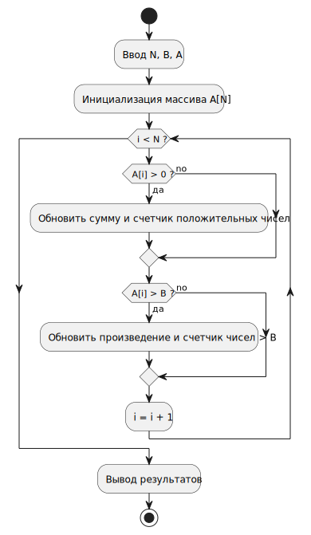

# Кейс-задача № 1
Разработать блок-схему алгоритма, написать код программы на двух языках высокого уровня, составить тестовые примеры исходных данных, которые охватывали бы прохождение всех ветвей алгоритма, составить описание объектных моделей кода. 

Дан одномерный массив А размерности N:
1)	Найти сумму положительных элементов и их количество.
2)	Найти количество элементов, больших заданного числа В и их произведение.

## 1. Блок-схема алгоритма

## Код программы
### Реализация на Python
- [Исходный код](./meaningless_algorithm.py)

### Реализация на C++
- [Исходный код](./meaningless_algorithm.cpp)

## Описание решения
Реализация крайне проста и использует минимальный набор конструкций языка программирования:

| № | Обязанность                | Оператор         | Язык       |
|---|----------------------------|------------------|------------|
| 1 | Массив вводимых чисел      | `[]`             | **python** |
|   | -                          | `vector<double>` | **c++**    |
| 2 | Защита от ошибочного ввода | `try..except`    | **python** |
|   | -                          | `return 1`       | **c++**    |
| 3 | Вывод сообщений            | `print`          | **python** |
|   | -                          | `cout`           | **c++**    |
| 4 | Определение цикла          | `for..range`     | **python** |
|   | -                          | `for(...)`       | **c++**    |

## Тестовые примеры данных
В таблицах указаны переменные, используемые в [реализации](meaningless_algorithm.py) алгоритма:
- **sum_positive** - сумма положительных чисел
- **count_positive** - количество положительных чисел
- **count_greater_than_b** - количество чисел > B
- **product_greater_than_b** - произведение чисел > B

### Пример 1: общий случай

| № | N | A               | B | sum_positive | count_positive | product_greater_than_b | count_greater_than_b |
|---|---|-----------------|---|--------------|----------------|------------------------|----------------------|
| - | 5 | -2, 3, 0, 5, -1 | 2 | 8            | 2              | 15                     | 2                    |

### Пример 2: нет положительных элементов

| №  | N  | A              | B   | sum_positive | count_positive | product_greater_than_b | count_greater_than_b |
|----|----|----------------|-----|--------------|----------------|------------------------|----------------------|
| -  | 4  | -1, -2, 0, -5  | -3  | 0            | 0              | -3                     | -3                   |

### Пример 3: нет элементов больше B

| № | N | A       | B | sum_positive | count_positive | product_greater_than_b | count_greater_than_b |
|---|---|---------|---|--------------|----------------|------------------------|----------------------|
| - | 3 | 1, 2, 3 | 5 | 6            | 3              | элементов не найдено   | 0                    |

### Пример 4: все элементы одинаковы и положительны

| № | N | A          | B | sum_positive | count_positive | product_greater_than_b | count_greater_than_b |
|---|---|------------|---|--------------|----------------|------------------------|----------------------|
| - | 4 | 2, 2, 2, 2 | 1 | 8            | 4              | 4                      | 16                   |

## Выводы
Реализация алгоритма на Python и C++ соответствует требованиям и успешно проверяется тестовыми данными.
