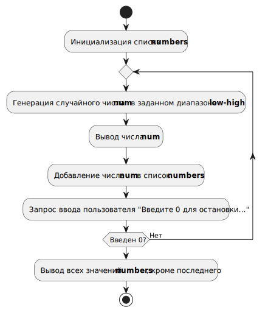

# Кейс-задача № 3

## Условия

- Написать программу с использованием языка программирования **Python**, которая будет генерировать последовательность случайных чисел до тех пор, пока пользователь не введёт ноль. 
- Вывести на экран все числа, кроме последнего.
- Подготовить презентацию с использованием различных цифровых технологий для объяснения алгоритма программы, с пояснением применения используемых операторов.

## Исходный код
Функция на **Python**, генерирующая последовательность случайных **целых** чисел, а затем печатающая их на консоли.

```jupyter
import random

def generate_and_show_numbers(low: int, high: int):
    numbers = []

    while True:
        num = random.randint(low, high)
        print(f"Случайное число: {num}")
        numbers.append(num)

        user_input = input("Введите 0 для остановки или Enter для продолжения: ")

        if user_input == '0':
            break

    print(numbers[:-1])

if __name__ == '__main__':
    generate_and_show_numbers(1, 10)

```

## Как запустить
Ввести в командной строке:
```shell
python .\get_random_numbers.py
```

## Объяснение алгоритма

1. **Импорт модуля random** - `import random` - позволяет использовать функцию randint() для генерации случайных чисел.
2. **Создание списка numbers** - `numbers = []` - пустой список для хранения сгенерированных чисел.
3. **Бесконечный цикл** - `while True` - программа будет работать, пока не встретит `break`.
4. **Генерация случайного числа** - `num = random.randint(low, high)` - создаёт случайное число в заданном диапазоне.
5. **Вывод числа и запрос ввода пользователя** - `input("Введите 0 для остановки...")` - если введён 0, цикл прерывается,
иначе - возврат к **3**.
6. **Вывод всех чисел, кроме последнего** - `numbers[:-1]` - срез списка, который выводит все элементы, кроме последнего.

Графическое представление алгоритма на _uml activity diagram_:


