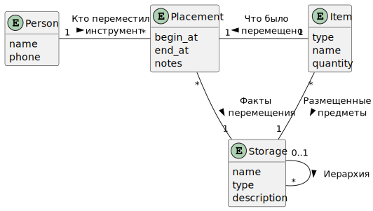
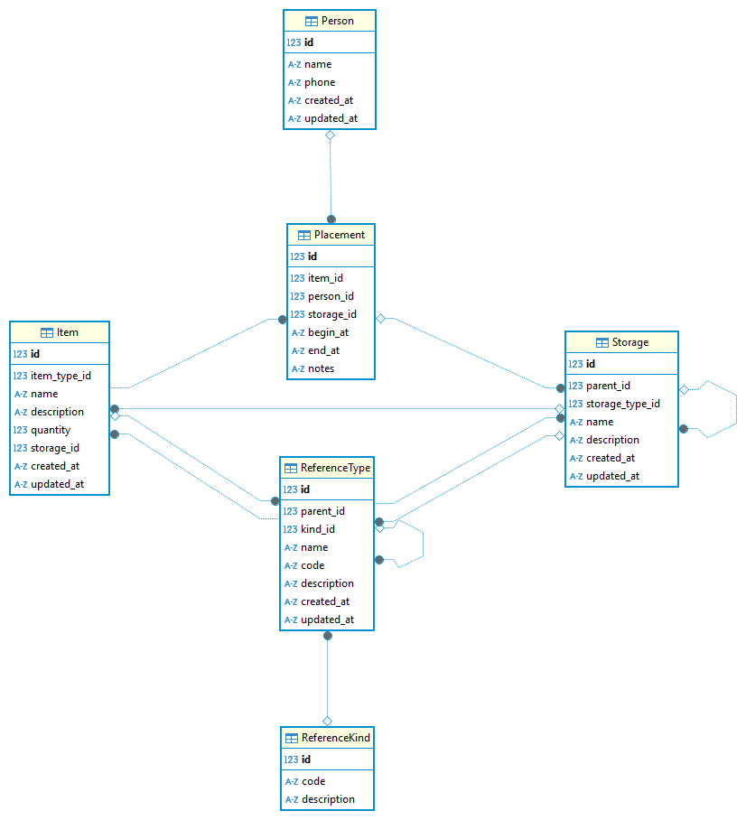

# Кейс-задача № 5
Разработайте проект базы данных с учетом всех этапов:
1)	Выбор темы: выбрать тему исследования, направить информацию научному руководителю практики от университета в личном кабинете (не допускается повторение предметной области для разработки базы данных). 
2)	Анализ требований: исследовать предметную область, определить основные сущности, атрибуты и связи.
3)	Моделирование данных: построить ER-диаграмму, обосновать выбор модели данных и нормализацию.
4)	Проектирование базы данных: создать схему базы данных с учетом требований безопасности и оптимизации, разработать SQL-скрипты для создания таблиц, ограничений, индексов, представлений.
5)	Реализация и тестирование: заполнить базу данных тестовыми данными, провести тестирование основных операций (запросов, вставки, обновления, удаления)
6)	Разработать отчёт, содержащий детальный анализ выполненных мероприятий и полученных результатов, с приложением соответствующих скриншотов, служащих иллюстрациями и подтверждающими данными.

## 1. Выбор темы
Проектируется система управления хранением инструментов в мастерской.

### 1.1. Концепция системы
Для эффективной работы мастерской требуется знать, в каком конкретно **месте хранения** 
(помещения, шкафы, полки, ящики) **находится** каждый **инструмент**,
кто из **сотрудников** этот **инструмент** взял и когда, сколько времени использовал.

Не должно быть потерянных **инструментов**, все **перемещения** должны фиксироваться.

## 2. Анализ требований

### 2.1. Функциональные требования
- FR1: Зарегистрировать перемещения инструмента
- FR2: Найти нужный инструмент
- FR3: Узнать, кто держит инструмент
- FR4: Определить весь перечень инструментов
- FR5: Найти все неоприходованные инструменты
- FR6: Добавить новый инструмент
- FR7: Получить количество инструментов по типам

### 2.2. Нефункциональные требования
- NFR1: Должна поддерживаться целостность хранимых данных.
- NFR2: СУБД должна быть максимально простой и бесплатной.

### 2.3. Правили и ограничения
- BR1: Запрещается дублирование перемещений инструментов 
(когда инструмент уже находится в указанном месте хранения или у того же человека).
- BR2: Инструмент не может одновременно находиться и в месте хранения, и у человека.

## 3. Модель данных
На основании анализа Концепции системы можно выделить следующие основные сущности:
- **Инструмент** - предмет, обладающий некоторыми характеристиками, в том числе **количеством**.
- **Место хранения** - место, где находится **Инструмент** (может быть иерархическим: здание-комната-шкаф-полка-ящик).
- **Сотрудник** - человек, который перемещает **Инструменты** по **Местам хранения** или забирает себе.
- **Перемещение** - факт передачи **Инструмента** **Сотрудником** из одного **Места хранения** в другое.

На ER-диаграмме ниже показана концептуальная модель данных:



Сущности концептуальной модели с наиболее важными атрибутами:
- **Person** - человек (сотрудник)
  - **name** - имя человека
  - **phone** - телефон для быстрой связи
- **Item** - предмет (инструмент)
  - **type** - тип инструмента (может быть составным)
  - **name** - имя инструмента
  - **quantity** - количество
- **Storage** - место хранения
  - **name** - имя
  - **type** - тип места хранения
  
Связи между сущностями:
- **Person-Placement** - человек может перемещать много предметов много раз
- **Placement-Item** - перемещается всегда один предмет
- **Storage-Item** - в месте хранения могут лежать много предметов
- **Placement-Storage** - много случаев перемещения предметов между местами хранения
- **Storage-Storage** - места хранения могут быть иерархическими

Кроме представленных сущностей, будут использованы справочники, которые будут спроектированы позже.

## 4. Проектирование
Для проектирования и реализации выбрана СУБД SQLite и инструмент DBeaver.
Выбор SQLite обусловлен первоначальным требованием NFR2.
Инструмент DBeaver выбран из-за доступности и удобства. 

На основании концептуальной модели данных создана физическая модель:


Сущностям концептуальной модели соответствуют таблицы БД, атрибутам - колонки в таблицах, а связям - внешние ключи.
Кроме того, добавлены новые таблицы:
- **ReferenceType** - универсальный иерархический справочник (может хранить типы инструментов и мест хранения).
- **ReferenceKind** - дискриминатор справочника (определяет, что за тип справочника используется).

Таблицы **Item**, **Person**, **Storage**, **ReferenceType** дополнены атрибутами аудита, 
позволяющими узнать, когда был добавлен или изменен инструмент.

Таблица **Placement** дополнена атрибутами **begin_at** и **end_at**, описывающими интервал дат/времени, 
на протяжении которого инструмент хранится в месте хранения или у сотрудника, 
а атрибут **notes** может содержать комментарии (например, причину перемещения).

Для часто используемых запросов созданы представления (views).

## 5. Реализация и тестирование

### 5.1. Принципы организации БД
Функциональные требования и бизнес-правила реализованы с помощью статических (нормализованная схема) 
и динамических (триггеры и ключи) средств.

Проект БД организован следующим образом:
- **ddl** - скрипты создания структуры БД
- **dml** - скрипты наполнения данными
- **queries** - реализация функциональных требований

```shell
├── ddl/
├──── tables/
│     └── all_tables.sql
├──── triggers/
│     └── all_triggers.sql
├──── views/
│     └── all_views.sql
├── dml/
│   ├── cleanup.sql
│   └── test_data.sql
└── queries/
    ├── Все инструменты.sql
    ├── Все неприходные инструменты.sql
    ├── Добавление нового инструмента.sql
    ├── Дочерние элементы родительского по его ID.sql
    ├── Инструмент по имени.sql
    ├── Количество инструментов по типам.sql
    ├── Кто взял инструмент с ID.sql
    ├── Люди, которые еще не вернули инструменты.sql
    ├── Поместить инструмент в место хранения.sql
    ├── Сколько дней удерживаются инструменты.sql
    ├── Текущее местоположение инструмента с ID.sql
    └── У кого на руках инструменты.sql
```
### 5.1. Создание схемы

Таблица **Item**:
``` sql
CREATE TABLE Item (
    id INTEGER PRIMARY KEY AUTOINCREMENT,
    item_type_id INTEGER NOT NULL,
    name TEXT NOT NULL,
    description TEXT,
    quantity INTEGER NOT NULL DEFAULT 1 CHECK (quantity >= 1),
    storage_id INTEGER,
    created_at DATETIME NOT NULL DEFAULT CURRENT_TIMESTAMP,
    updated_at DATETIME NOT NULL DEFAULT CURRENT_TIMESTAMP,
    FOREIGN KEY (storage_id) REFERENCES Storage(id) ON DELETE SET NULL,
    FOREIGN KEY (item_type_id) REFERENCES ReferenceType(id) ON DELETE RESTRICT
);
```

Таблица **Person**:
```sql
CREATE TABLE Person (
    id INTEGER PRIMARY KEY AUTOINCREMENT,
    name TEXT NOT NULL,
    phone TEXT,
    created_at DATETIME NOT NULL DEFAULT CURRENT_TIMESTAMP,
    updated_at DATETIME NOT NULL DEFAULT CURRENT_TIMESTAMP
);
```

Таблица **Placement**:
```sql
CREATE TABLE Placement (
    id INTEGER PRIMARY KEY AUTOINCREMENT,
    item_id INTEGER NOT NULL,
    person_id INTEGER,  -- Кто совершил действие (может быть NULL для системных перемещений)
    storage_id INTEGER, -- Перемещение между местами хранения
    begin_at DATETIME NOT NULL DEFAULT CURRENT_TIMESTAMP,
    end_at DATETIME, -- Дата завершения может быть открытой (пустой)
    notes TEXT,
    FOREIGN KEY (item_id) REFERENCES Item(id) ON DELETE CASCADE,
    FOREIGN KEY (person_id) REFERENCES Person(id) ON DELETE SET NULL
);
```

Таблица **Storage**:
```sql
CREATE TABLE Storage (
    id INTEGER PRIMARY KEY AUTOINCREMENT,
    parent_id INTEGER,
    storage_type_id INTEGER NOT NULL,
    name TEXT NOT NULL,
    description TEXT,
    created_at DATETIME NOT NULL DEFAULT CURRENT_TIMESTAMP,
    updated_at DATETIME NOT NULL DEFAULT CURRENT_TIMESTAMP,
    FOREIGN KEY (parent_id) REFERENCES Storage(id) ON DELETE CASCADE,
    FOREIGN KEY (storage_type_id) REFERENCES ReferenceType(id) ON DELETE RESTRICT
);
```
Таблица **ReferenceType**:
```sql
CREATE TABLE ReferenceType (
    id INTEGER PRIMARY KEY AUTOINCREMENT,
    parent_id INTEGER,
    kind_id INTEGER,
    name TEXT NOT NULL,
    code TEXT NOT NULL UNIQUE,
    description TEXT,
    created_at DATETIME NOT NULL DEFAULT CURRENT_TIMESTAMP,
    updated_at DATETIME NOT NULL DEFAULT CURRENT_TIMESTAMP,
    FOREIGN KEY (parent_id) REFERENCES ReferenceType(id) ON DELETE CASCADE
    FOREIGN KEY (kind_id) REFERENCES ReferenceKind(id) ON DELETE CASCADE
);
```

Создание триггеров и представлений см. в исходном коде.

### 5.3. Реализация функциональных требований
Функциональным требованиям (см. 2.1.) соответствуют SQL-запросы в каталоге /**queries**.

Реализованные запросы:

| № | Требование                                     | Запрос                                    |
|---|------------------------------------------------|-------------------------------------------|
| 1 | FR1: Зарегистрировать перемещения инструмента  | Поместить инструмент в место хранения.sql |
| 1 | FR2: Найти нужный инструмент                   | Инструмент по имени.sql                   |
| 1 | FR3: Узнать, кто держит инструмент             | Кто взял инструмент c ID.sql              |
| 1 | FR4: Определить весь перечень инструментов     | Все инструменты.sql                       |
| 1 | FR5: Найти все неоприходованные инструменты    | Все неоприходованные инструменты.sql      |
| 1 | FR6: Добавить новый инструмент                 | Добавление нового инструмента.sql         |
| 1 | FR7: Получить количество инструментов по типам | Количество инструментов по типам.sql      |

Кроме того, реализованы вспомогательные SQL-запросы (см. исходный код).

### 5.4. Заполнение тестовыми данными
Тестовые данных содержатся в **test_data.sql** и имитируют типичное наполнение БД данными 
о людях, инструментах, местах хранения и истории перемещения.

## 6. Отчет о результатах выполнения
### 6.1. Методика тестирования
Для простоты выполняется ручное тестирование: применение SQL-запросов к тестовым данным.
Запросы, меняющие состояние БД, выполняются внутри транзакции, которая затем откатывается:
```sql
BEGIN TRANSACTION;

INSERT INTO Item (...) ...

ROLLBACK;
```

### 6.2. Тестирование

#### 6.2.1. Запрос "Все инструменты"

Тестовые данные:
```sql
INSERT INTO Item (item_type_id, name, description, quantity, storage_id) VALUES
(4, 'Дрель Makita HP1630', 'Дрель 550Вт, реверс, 0-3000 об/мин', 3, 1),
(5, 'Шуруповерт Bosch GSR 12V', 'Аккумуляторный, комплект 2 батареи', 5, 1),
(4, 'Дрель DeWalt DCD771', 'Безударная, 2 скорости, кейс', 2, 3),
(3, 'Мультиметр DT-830B', 'Цифровой, измерение напряжения, тока, сопротивления', 1, NULL),
(2, 'Набор гаечных ключей', '6-22 мм, 8 предметов', 10, 2),
(2, 'Молоток Stanley 1-54-069', 'Фиберглассовая ручка, 800г', 4, 3);
```

Тестируемый запрос:
```sql
SELECT i.id, i.name, t.name AS type, s.name AS storage 
FROM Item i
JOIN ReferenceType t ON i.item_type_id = t.id
LEFT JOIN Storage s ON i.storage_id = s.id;
```

Результат:


#### 6.2.2. Запрос "Добавление нового инструмента"
> Пояснение:
> Из-за некоторых особенностей DBeaver результаты вложенного в транзакцию SELECT не видны, 
> поэтому придется использовать трюк с SAVEPOINT.

Тестовые данные:
см. 6.2.1.

Тестируемый запрос:
```sql
SAVEPOINT test_insert;

INSERT INTO Item (item_type_id, name, description, quantity, storage_id)
VALUES (
    (SELECT id FROM ReferenceType WHERE name LIKE '%Ручной инструмент%' LIMIT 1),
    'Тестовая отвертка',
    'Тестовый инструмент для проверки',
    1,
    (SELECT id FROM Storage WHERE name LIKE '%Основной склад%' LIMIT 1)
);

SELECT * FROM Item WHERE Item.name = 'Тестовая отвертка';

ROLLBACK TO SAVEPOINT test_insert;
```
Результат:


#### 6.2.3. Запрос "Поместить инструмент в место хранения"
Тестовые данные:
см. 6.2.1.

Тестируемый запрос:
```sql
SAVEPOINT test_insert;


-- 1. Добавляем инструмент в систему (без указания storage_id)
INSERT INTO Item (item_type_id, name, description, quantity)
VALUES (
    (SELECT id FROM ReferenceType WHERE name LIKE '%Шуруповерт%' LIMIT 1),
    'Шуруповерт DeWalt DCF887',
    'Аккумуляторный, 18V, с быстрозажимным патроном',
    1
);

-- 2. Фиксируем размещение с указанием сотрудника
INSERT INTO Placement (item_id, person_id, storage_id, begin_at, notes)
VALUES (
    last_insert_rowid(),  -- ID нового инструмента
    15,                   -- ID сотрудника, который размещает
    19,                   -- ID места хранения
    CURRENT_TIMESTAMP,
    'Первичное размещение'
);

-- 3. Обновляем текущее местоположение в таблице Item
UPDATE Item
SET storage_id = 15
WHERE id = last_insert_rowid();

-- Проверка

SELECT 
    i.name AS инструмент,
    p.name AS разместивший_сотрудник,
    pl.begin_at AS дата_размещения,
    pl.notes,
    s.name AS место
FROM Item i
JOIN Placement pl ON i.id = pl.item_id
JOIN Storage s ON pl.storage_id = s.id
JOIN Person p ON pl.person_id = p.id;


ROLLBACK TO SAVEPOINT test_insert;
```

Результат:


#### 6.2.3. Запрос "Переместить инструмент между местами хранения"
Тестовые данные:
см. 6.2.1.

Тестируемый запрос:
```sql
SAVEPOINT test_insert;

-- Тестируемый запрос
-- 1. Закрываем текущее активное размещение (если есть)
UPDATE Placement 
SET end_at = CURRENT_TIMESTAMP,
    notes = 'Перемещение'
WHERE item_id = 29 -- Перфоратор
  AND end_at IS NULL;

-- 2. Создаем запись о новом размещении
INSERT INTO Placement (item_id, person_id, storage_id, begin_at, notes)
VALUES (
    29, -- Перфоратор
    15,  -- Иванов
    17, -- Цех №1
    CURRENT_TIMESTAMP,
    'Перемещение'
);

-- 3. Обновляем текущее местоположение инструмента
UPDATE Item
SET storage_id = 17 -- Цех №1
WHERE id = 29;

-- Проверка

SELECT 
    i.name AS инструмент,
    s.name AS место_хранения,
    p.name AS разместивший_сотрудник,
    pl.begin_at AS дата_размещения,
    pl.notes
FROM Item i
JOIN Placement pl ON i.id = pl.item_id
JOIN Storage s ON pl.storage_id = s.id
JOIN Person p ON pl.person_id = p.id;

ROLLBACK TO SAVEPOINT test_insert;
```

Результат:


#### 6.2.4. Запрос "Текущее местоположение инструмента"
Тестовые данные:
- Отвертка желтая - id=1

Тестируемый запрос:
```sql
SELECT 
    i.id AS item_id,
    i.name AS item_name,
    s.id AS storage_id,
    s.name AS storage_name,
    s.description AS storage_description,
    CASE 
        WHEN pl.person_id IS NOT NULL THEN 'У человека на руках'
        WHEN pl.storage_id IS NOT NULL THEN 'В хранилище'
        ELSE 'Местоположение неизвестно'
    END AS location_status,
    p.name AS held_by_person,
    p.phone AS person_phone,
    pl.begin_at AS since_date,
    julianday('now') - julianday(pl.begin_at) AS days_in_location
FROM 
    Item i
LEFT JOIN 
    Placement pl ON i.id = pl.item_id AND pl.end_at IS NULL
LEFT JOIN 
    Storage s ON pl.storage_id = s.id
LEFT JOIN 
    Person p ON pl.person_id = p.id
WHERE 
    i.id = 1;
```

Результат:


### 6.3. Итоги
Запросы протестированы вручную, прототип БД в целом выполняет поставленные цели. 